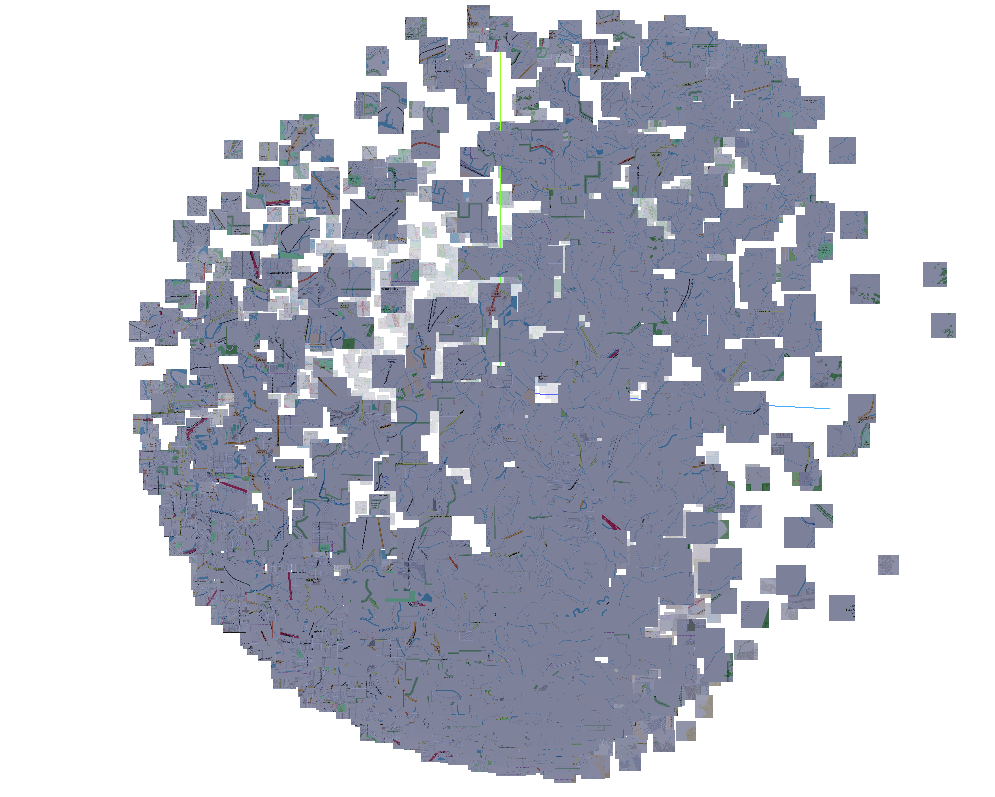
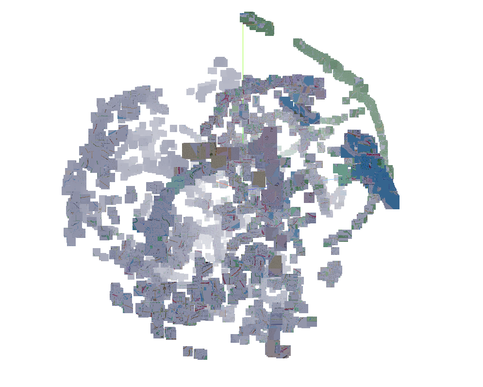
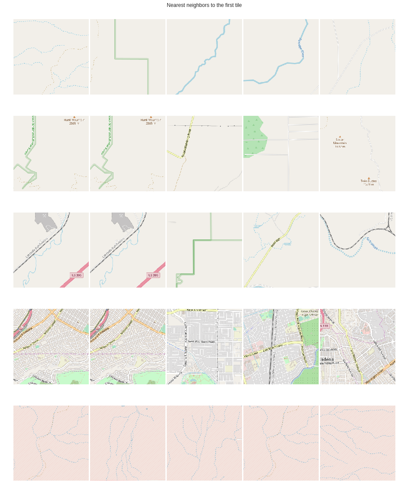
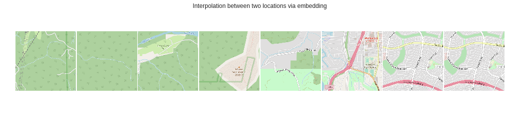

# Pytorch Mixed Precision Implementation

This project is inspired by this excellent blogpost: https://www.sentiance.com/2018/05/03/venue-mapping/

#### Note: This implementation requires FP16 support. If your GPU does not have that, just disable it with `amp.init(enable=False)` in trainer.py. You might also have to change the batch size in config.py.

## How to generate tiles from openstreetmap data

Use the maperitive app to generate data

```
the command to generate tiles:

generate-tiles minzoom=14 maxzoom=14

store ti to ./data folder
```

## Environment setup (for pytorch and amp) and start training

    conda env create -f  environment.yml
    conda activate loc2vec
    git clone https://github.com/NVIDIA/apex
    cd apex
    pip install -v --no-cache-dir --global-option="--cpp_ext" --global-option="--cuda_ext" .
    cd ..
    python loc2vec


## Credits
- Siamese-Triplet Implementation - https://github.com/adambielski/siamese-triplet
- OpenstreetMap TileServer - https://github.com/Overv/openstreetmap-tile-server

## Wanna Help?
First thanks! Below are a few things to implement. If you are a GIS expert, we can brainstorm a few ideas for collaboration. Open a issue and we can discuss there.

###  TODO:

- [X] Create a micro-service api
- [ ] Train models with 17 scale
- [ ] Train multy-scale model

## Results
#### PCA

#### TSNE

#### Nearest Neighbors (first column is the query image)

#### Interpolation in Embedding Space


